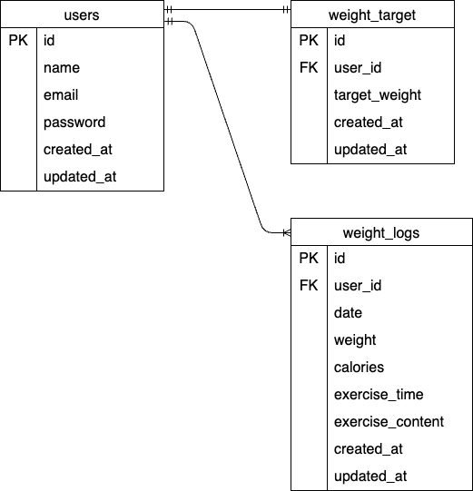

#「pigly」体重管理アプリ

## 環境構築

```bash
Dockerビルド
・git clone git@github.com:kakigoori-ogura/pigly-app.git
・compose up -d
・compose exec app php artisan migrate
・compose exec app php artisan db:seed

Laravel環境構築
・ docker-compose exec php bash
・composer install
・cp .env.example.env
・php artisan key:generate

```

## 使用技術

- PHP 8.5.3
- Laravel 12.58.0
- MySQL 8.4.9
- Docker 28.3.2
- Docker Compose

## ER図



## URL

- 新規会員登録：http://localhost/register
- 新規会員登録2：http://localhost/weight/initial
- ログイン：http://localhost/login
- 目標体重：http://localhost/goal/edit

## テスト用アカウント

- メールアドレス：test@gmail.com
- パスワード：aaaaaaaaaa
